# 👋 Hi, I'm Jagreet Kumar Dangi

🎓 B.Tech CSE (AI & ML) Student  
💻 C++ | Java | Python | JavaScript  
🤖 AI/ML | DSA | Web Development

---

## 📊 My GitHub History!

  
  

---

## 🔥 GitHub Streak

  

---

## 🛠️ Languages & Tools

  

---

## 🚀 Featured Projects

| Project | Description |
|---|---|
| 🩺 Diabetic Retinopathy | AI/ML project for diabetic retinopathy classification |
| 🎬 CineAura | Movie discovery website |
| 💻 DSA | Data Structures & Algorithms practice |
| 🌐 Personal Portfolio | Personal developer portfolio |

---

## 📈 Contribution Graph

---

## 🌐 Connect With Me

  

